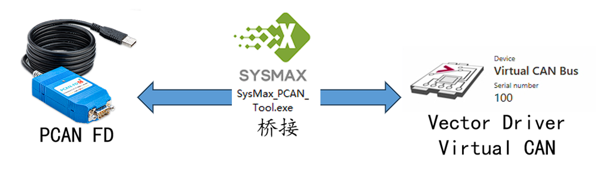

# sysmax-vector-bridge
The SysMax Vector bridging tool is a software that establishes communication between virtual CAN devices of the Vector driver and real CAN/FD hardware to achieve a low-cost alternative to Vector CAN/FD devices.
## Introduce
This scheme realizes the compatibility of CAN interface devices with Vector software by accessing the Virtual CAN channel - Virtual CAN Channel of the Vector driver. This software Bridges the CAN/CAN FD data sent and received by the PCAN FD device with the Vector virtual CAN channel to achieve the purpose of communicating with the real physical bus through the Vector virtual CAN channel.

## Vector Software Adaptation Features (Of Vector Virtual CAN channel)
 - This solution does not damage the Vector driver and software, and can be used for commercial use
 - Excellent compatibility, no specific version of Vector driver is specified
 - Support for simultaneous use with Vector hardware
 - Support high-speed CAN and CAN FD functions
 - Support any bit rate and sampling point adjustment: 25Kbit/s ~ 12Mbit/s
 - The timestamp resolution is approximately 1μs
 - Support bridging multi-device and multi-channel use at the same time
 - Support all functions with CANOE, including CAPL programming
 - Support multiple apps to open the same device at the same time
 - Support PCAN software and Vector software to open the same device at the same time
 - Support software (All software that supports Vector Virtual CAN channel):
 > - CANoe - https://www.vector.com/int/en/products/products-a-z/software/canoe/#
 > - CANape - https://www.vector.com/us/en/products/products-a-z/software/canape/
 > - CAPL - https://www.vector.com/at/en/know-how/capl/
 > - API and secondary development software based on Vector CAN driver
 > - TSmaster - https://github.com/TOSUN-Shanghai/TSMaster
 
 > - BusMaster - https://github.com/rbei-etas/busmaster
 

### Key features of this tool
 - Support users to flexibly configure the mapping relationship between PCAN FD hardware channel and Vector virtual channel
 - Support multi-channel bridging configuration, no need to intervene in the software after configuration
 - Support auto-start at boot, and automatically start the bridge according to user configuration
 - After the bridge starts, it is also possible to use PCAN-view or PCAN-exploer for both CAN/FD data and bus condition monitoring when using Vector software
### User Case
 - The Vector software license has been obtained(or cracked), but a cost-effective hardware device is still needed as a substitute
 - There is already a Vector VN series device, but the number of CAN/FD channels is insufficient
 - Use free software developed based on the Vector driver (as follows), but also cost-effective hardware devices compatible with Vector are required
 > - The software independently developed based on Vector XL-Driver-Library
 > - Python CAN
 > - TSmaster
## Hardware Support
 - Full CAN and CAN FD supported - SysMax PCAN FD (https://item.taobao.com/item.htm?id=673931783731)
 - Only CAN supported - PEAK PCAN-USB FD
## OpenSource
At present, the project only exposes binaries and documentation, and may disclose the source code of the main bridging logic in the future.
## Usage
TODO
### Download
https://github.com/sysmax-cn/sysmax-vector-bridge/releases

### 